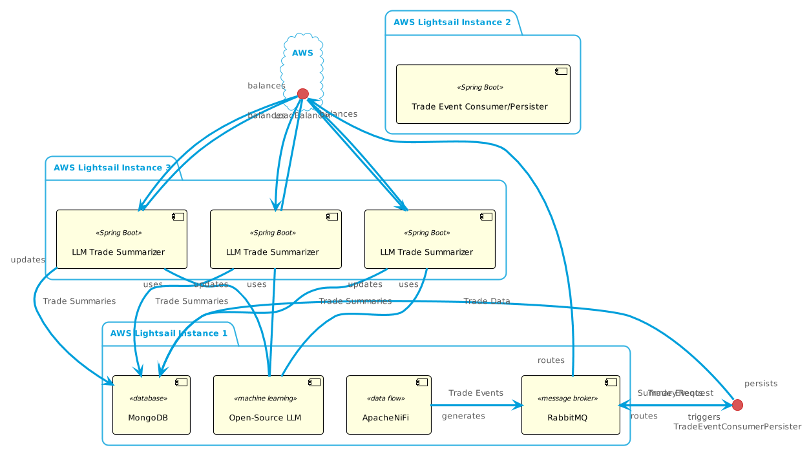
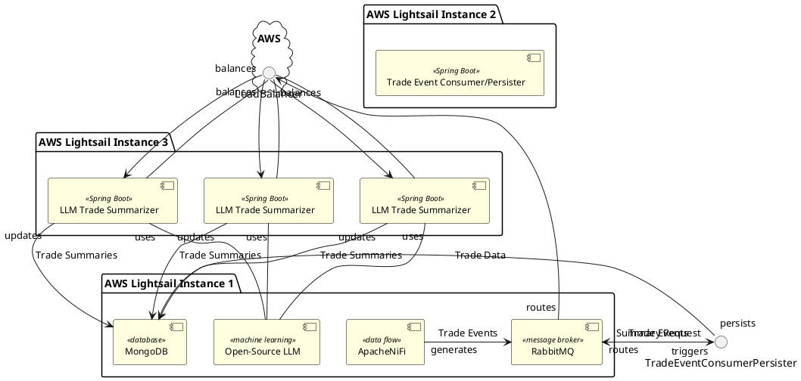
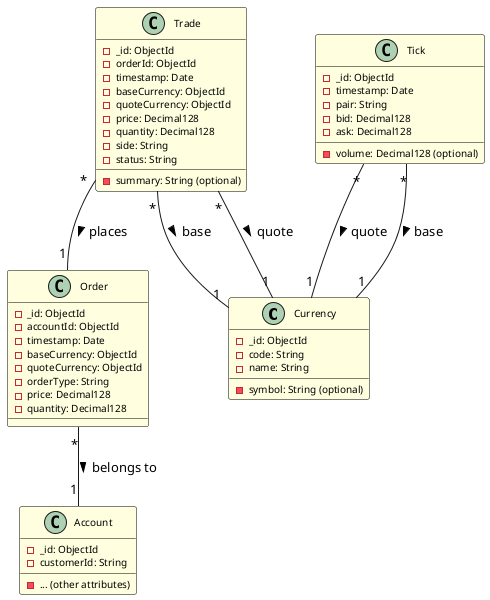

# FOREX Trade Summarizer with LLM
FOREX Trade Summarizer is Spring Boot, Apache Nifi, RabbitMQ, MongoDB, Java, LLM application that summarizes trade events using Java LLM libraries

## Introduction
This FOREX Trade Summarizer applications demonstrates an innovative approach to automating the generation of insightful trade summaries for FOREX trade events. 

By leveraging Large Language Models (LLMs) and a robust data pipeline, this application aims to empower traders and analysts with concise, informative summaries that can enhance decision-making and improve risk management.

## Value Proposition
In FOREX trading, timely and accurate information is crucial. The Trade Summarizer offers several key benefits:

- **Efficiency**: Automatically generate summaries of complex trade events, saving traders and analysts valuable time and effort. 
- Insights: Extract key information from trade data, highlighting important details and potential risks or opportunities. 
- **Decision Support**: Provide concise summaries that can be quickly reviewed to inform trading decisions. 
- **Risk Management**: Help identify potential risk factors by summarizing trade events in the context of market conditions. 
- **Scalability**: Handle large volumes of trade events with a scalable architecture that can adapt to your business needs.

## Technology Stack
- **LLM Provider**: Open-source LLM provider like GPT-Neo or Falcon-7B. 
- **Java**: Primary programming language for building the application components. 
- **Spring Boot**: Framework for creating robust and scalable backend services. 
- **LangChain4j**: Java library for simplifying the integration of LLMs into applications. 
- **Apache NiFi**: Visual dataflow tool for generating and processing trade events. 
- **RabbitMQ**: Message broker for reliable communication between components. 
- **MongoDB**: NoSQL database for storing trade events and summaries. 
- **Docker**: Containerization technology for consistent deployment across environments. 
- **Ansible**: Automation tool for provisioning AWS Lightsail instances and deploying Docker containers.

## Application Architecture

### The application consists of the following components:
- **Trade Event Generator (Apache NiFi)**: Creates realistic trade events based on configurable parameters and sends them to RabbitMQ. 
- **Trade Event Consumer/Persister (Spring Boot)**: Consumes trade events from RabbitMQ, persists them to MongoDB, and triggers the LLM Summarizer. 
- **LLM Trade Summarizer (Spring Boot)**: Consumes trade events, generates summaries using the LLM via LangChain4j, and updates the trade documents in MongoDB. 
- **MongoDB**: Stores raw trade events and LLM-generated summaries. 
- **RabbitMQ**: Facilitates reliable communication between the components.

## Deployment Architecture
The application is deployed on AWS Lightsail using Ansible for automation. The components are distributed across three Lightsail instances for scalability and isolation:

- **Instance 1**: MongoDB, Apache NiFi, Open-Source LLM, RabbitMQ 
- **Instance 2**: Trade Event Publisher, Trade Event Consumer/Persister 
- **Instance 3**: LLM Trade Summarizer (multiple instances for horizontal scaling)
Note: Consider using a Lightsail Load Balancer to distribute traffic to the LLM Summarizer instances.

## Data Modeling

## AWS Resources
This application leverages the following AWS services to create a scalable and reliable infrastructure for the FOREX Trade Summarizer:

### AWS Lightsail

Lightsail Instances: Three separate instances are provisioned for different components of the application:

- **Instance 1**: MongoDB, Apache NiFi, Open-Source LLM, RabbitMQ 
- **Instance 2**: Trade Event Publisher, Trade Event Consumer/Persister 
- **Instance 3**: LLM Trade Summarizer (multiple instances for horizontal scaling)
- (Optional) Lightsail Load Balancer:  For distributing traffic evenly across the LLM Summarizer instances to improve performance and resilience.

### Other Potential AWS Services (Optional)

- **Amazon ECR (Elastic Container Registry)**: A fully managed container registry to store, manage, and deploy your Docker images. 
- **Amazon SageMaker**: A fully managed service for building, training, and deploying machine learning models, including LLMs. Could be used to deploy the LLM component if you prefer a managed solution. 
- **Amazon DocumentDB** (with MongoDB compatibility): A scalable, highly available, and fully managed document database service compatible with MongoDB. Could be used instead of self-hosted MongoDB on Lightsail if you prefer a managed database solution. 
- **Amazon CloudWatch**: For monitoring the performance and health of your Lightsail instances, containers, and potentially the LLM model. 
- **AWS Secrets Manager**: A secure service for storing and retrieving secrets like API keys and database credentials. 

### Ansible for Infrastructure as Code (IaC)

The deployment and management of these AWS resources are automated using Ansible. The provided Ansible playbook (playbook.yml) defines the necessary tasks to:

- Create Lightsail instances. 
- Install Docker and Docker Compose. 
- Pull Docker images from your chosen container registry (e.g., Docker Hub or ECR). 
- Configure and start the containers on each instance.
- (Optional) Set up a Lightsail Load Balancer.

